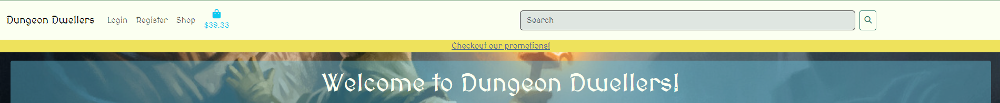
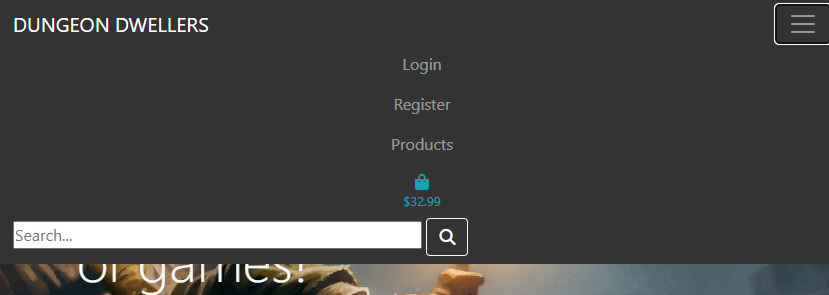
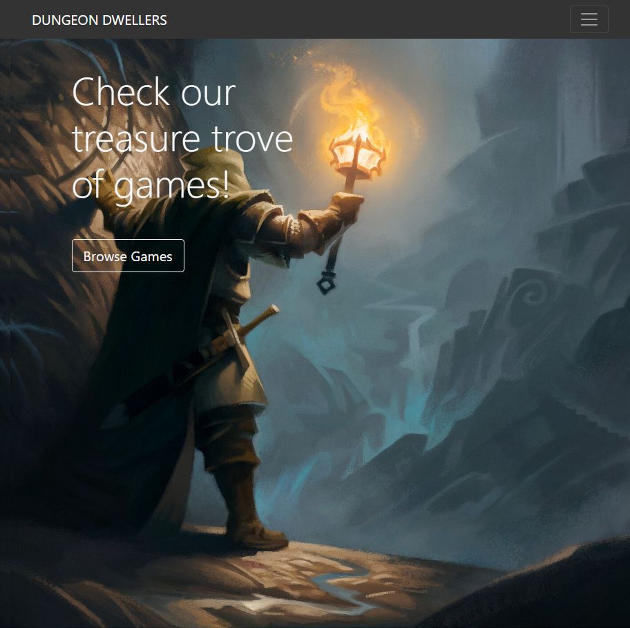
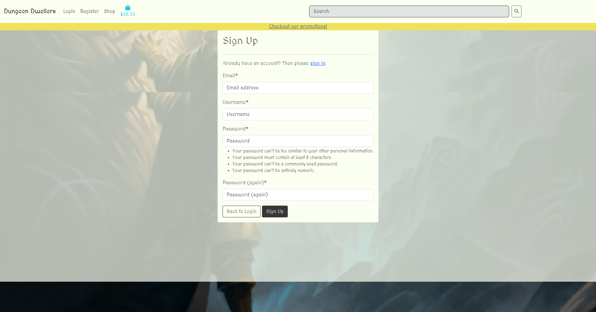
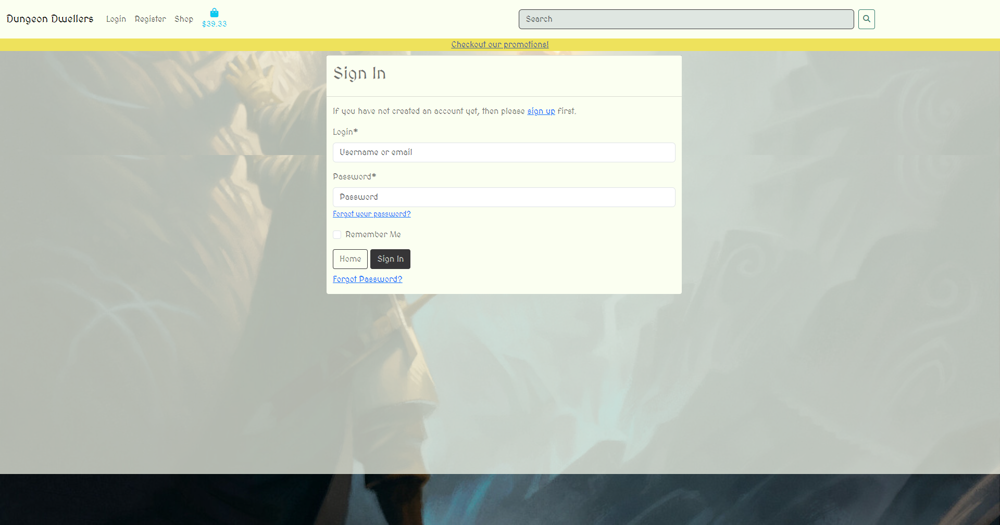
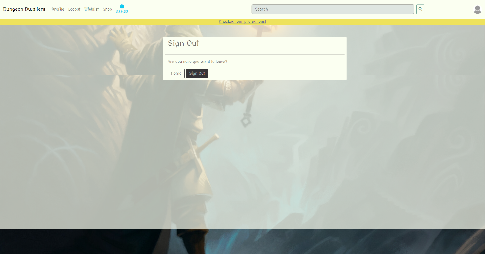
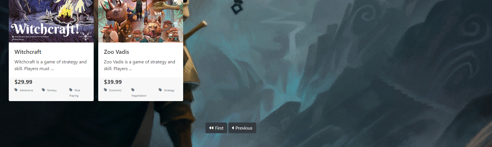
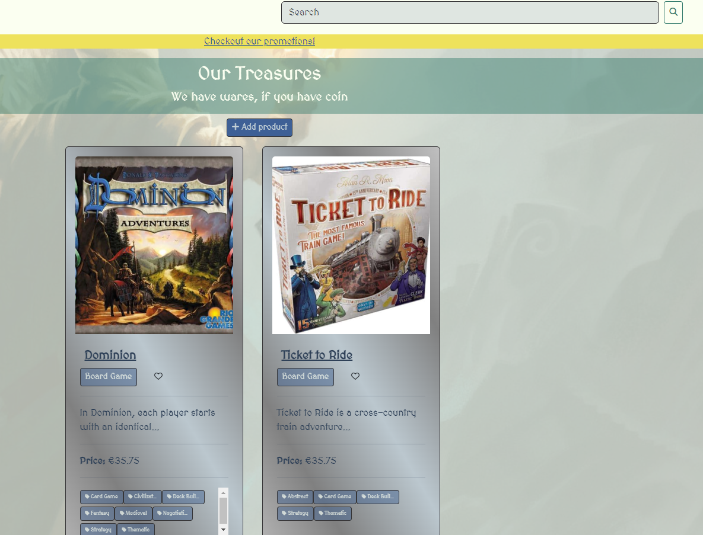
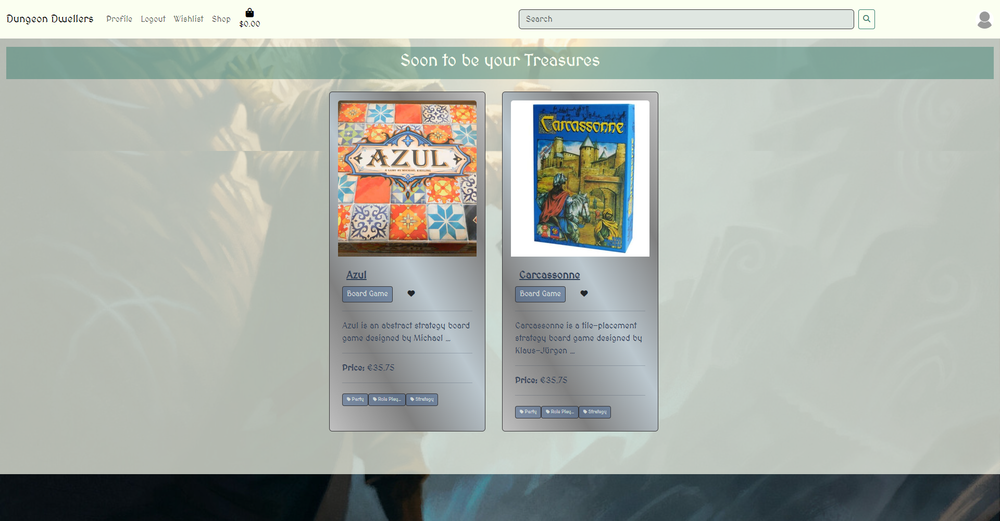
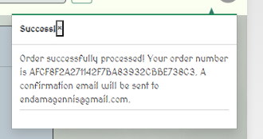

# Features

[Return to README](README.md)

## Minimum Viable Product Features (Implemented)

### Nav Bar

The navigation bar allows the user to navigate to the home page, login, register. The navbardynamically updates to show logout functionality to authenticated users. On smaller screens, the navbar collapses into a dropdown menu.

  - #### Navbar
  

  - #### Navbar dropdown
  

### Home Page

The home page contains a feed of posts created by users.

  - #### Home page
  

### Authentication
Site users can use authentication features such as register, login and logout.

  - #### Registration
  

  - #### Login
  

  - #### Logout
  

## Nice To have/ Future Features

### Implemented

  #### Pagination

  When the home page has above 8 posts, a new page is created, and a navigation button is created to navigate to the new page. The new page, then, has navigation to return to the previous page.
   
   - Next
  

  - Previous
  

  #### Custom Error handling

   When common errors, 404 and 500, occur, the user is redirected to a custom page from where they can navigate home or to the previous page.

  #### Search for products
  
  Fuctions but one constraint is that the user must be on the products page. In future I hope to allow searching from any page
    - Search Function
    

#### Wishlist
Authenticated users can add items to their wishlist
    

### Notifications

### Future Implementations
  
  #### Comments
  Another common fearture that will be added in the future is comments. Comments create more interactivity and generates engagement. 

  #### Multiple images per product
  Given boardgames often have a lot of components and set up, this would be nice to show how large the game actually is and what play might look like. The card of each post could have a carosel to swipe through images

####
Inventory

####
Stock takin

####
Payments
