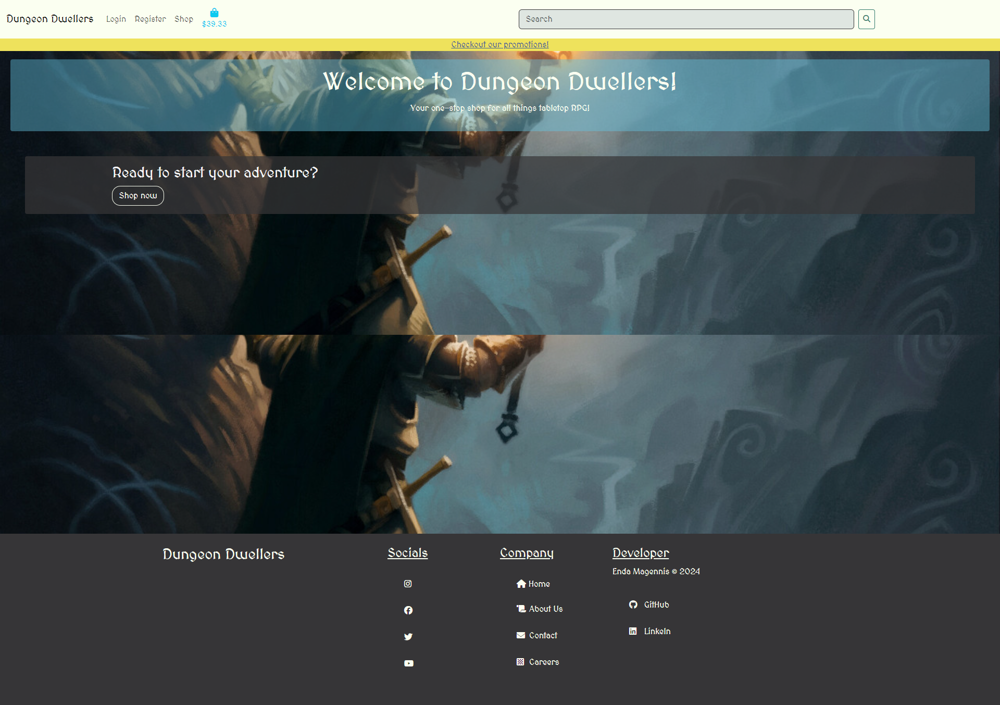
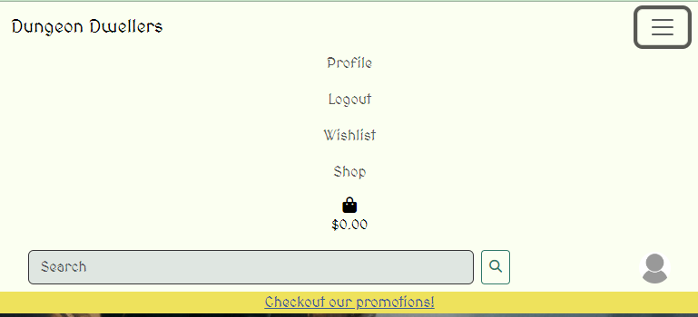
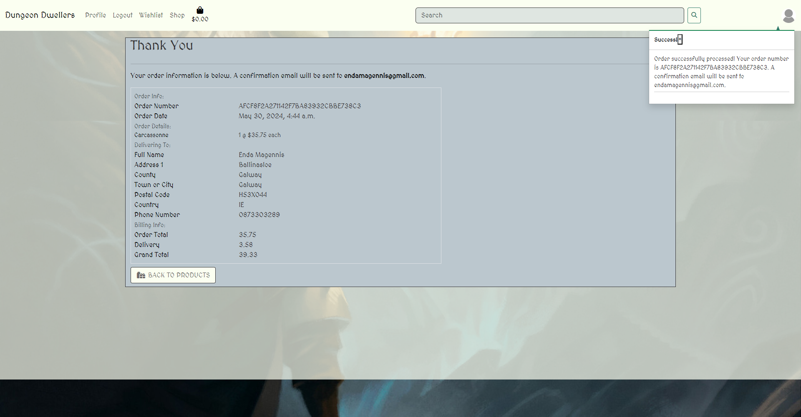
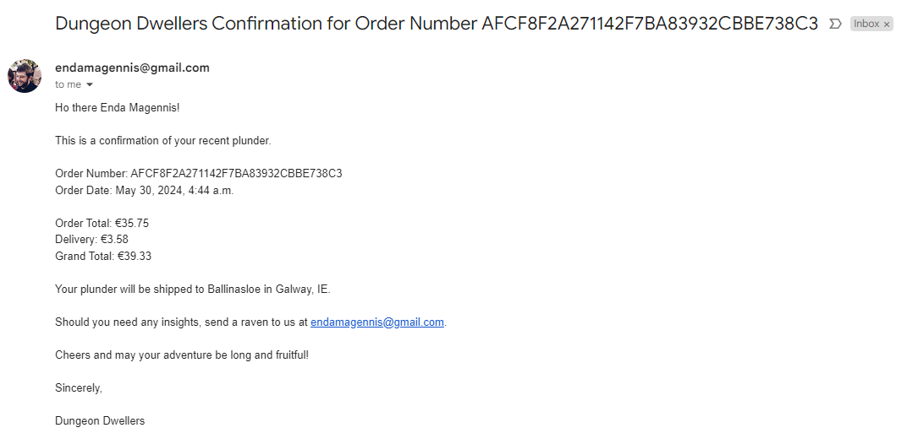
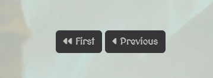
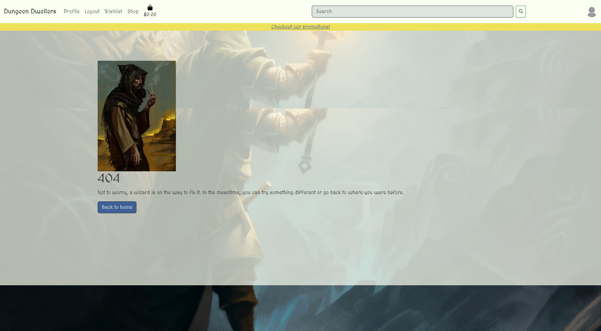
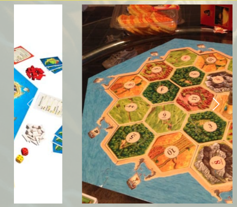

# Features

[Return to README](README.md)

## Minimum Viable Product Features (Implemented)

### Home Page

Contains the main navigation and a footer. The image below is inacurate as a result of how [GoFullPage](chrome://extensions/) captures the full page image. The page also features a call to action.

  - #### Home page
  

### Authentication
Site users can use authentication features such as register, login and logout.

  - #### Registration
  

  - #### Login
  

  - #### Logout
  

### Navbar

The navbar contains the navigable links to the rest of the site

### Payments

As discussed below in [TESTING.md](TESTING.md) the payments are functional

### Email Confirmation

## Nice To have/ Future Features

### Implemented

#### Pagination

When the home page has above 8 posts, a new page is created, and a navigation button is created to navigate to the new page. The new page, then, has navigation to return to the previous page.
  
  - Next

- Previous

#### Custom Error handling

  When common errors, 404 and 500, occur, the user is redirected to a custom page from where they can navigate home or to the previous page.

  

#### Search for products

User can now search by using the search bar, by clicking tags, or by clicking the category on the product
  - Search Function
  

#### Wishlist
Authenticated users can add items to their wishlist
    

### Notifications

#### Multiple images per product

 The image below shows the transition period of two images on the carousel

### Future Implementations
  
  ### Mailing List
  A mailing list is a great way to let loyal customers know about upcoming events, discounts and products

  ### Discounts
  Add discounts to featured products so that they are not only graphically different from the others
  
  #### Comments
  Another common fearture that will be added in the future is comments. Comments create more interactivity and generates engagement. 

  #### Inventory
  The ability to track inventory and dynamically update the stock as items are purchased is an essential next step
  
  #### Reviews
  Customer reviews can drive engagement and site traffic as well as give the owner a good idea of what will sell

  #### Events
  Table-Top and boardgame communities are constantly looking for new players fro their own games and many boardgame stores run events for the community.

