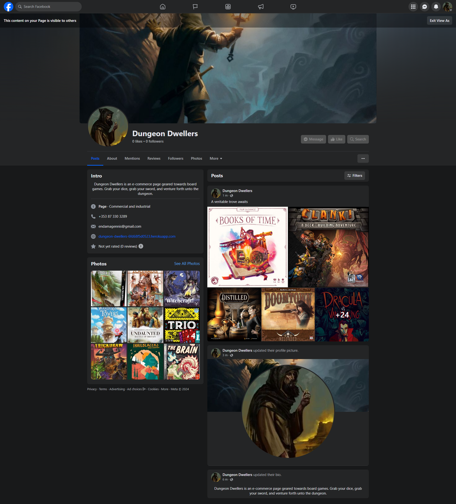
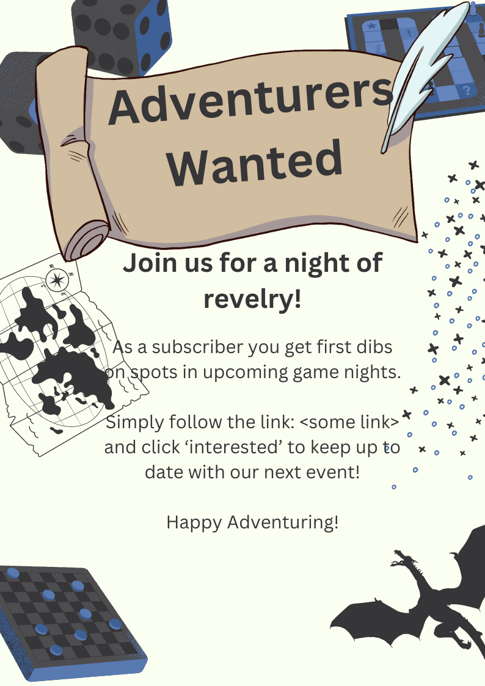
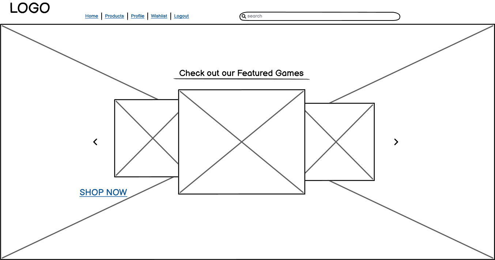
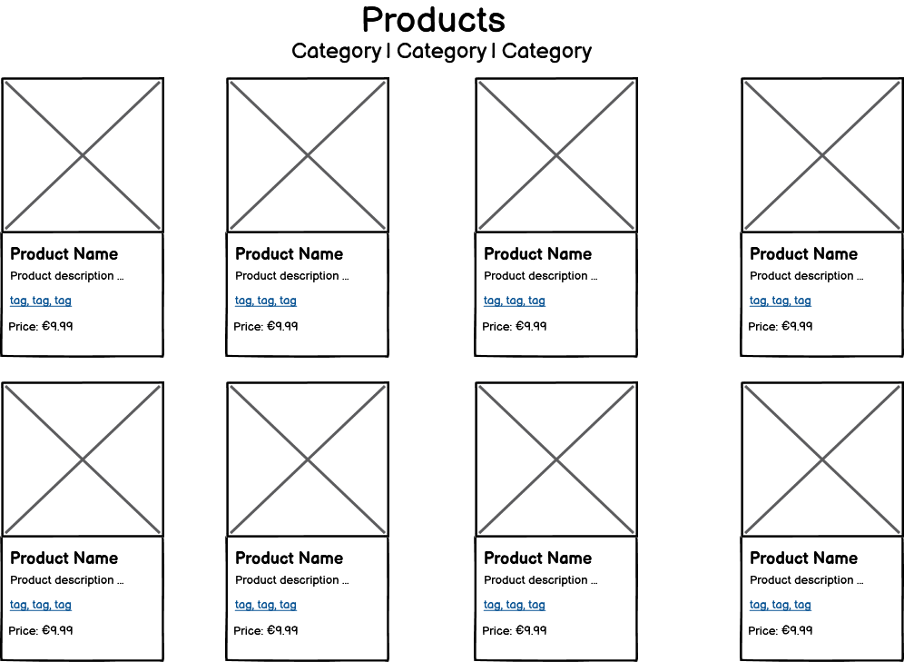
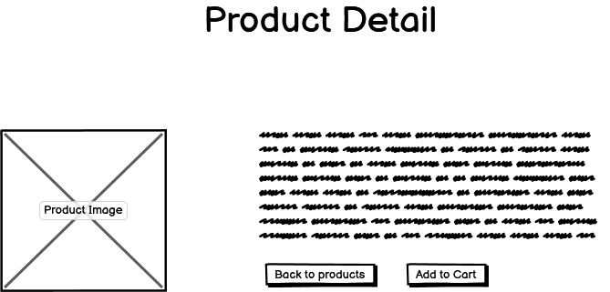
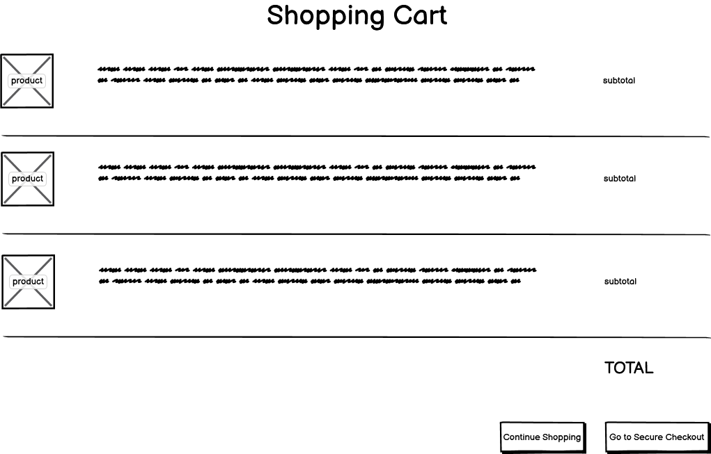
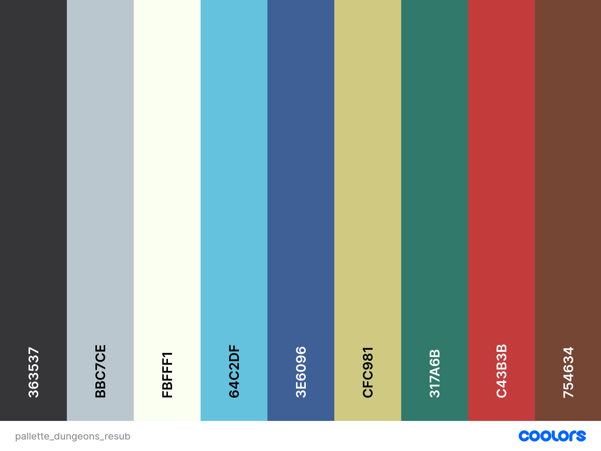
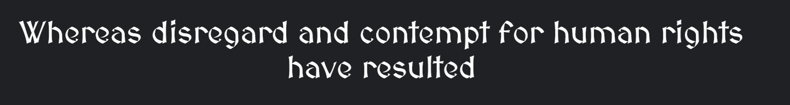
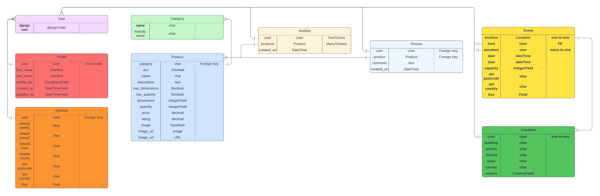

# Dungeon Dwellers 

  

  - [Deployed Site](https://dungeon-dwellers-resub-bcad99aabba4.herokuapp.com/)

## Card details for test payment
4242424242424242 04/28 42424

## About 
   
  Dungeon Dwellers is an e-commerce site aimed at board game enthusiasts. The name is evocative of the adventuring and exploration which is common for character dirven board games such as Dungeons & Dragons.

---

## UX

The UX has been overhauled since last submission. Custom color variables were created and used throughout to have more consistent styling. Aria-labels are present for every link and button. 

### User Stories and project boards

[User Stories Project Board](https://github.com/users/EndaMagennis/projects/14)

[Home Page Project Board](https://github.com/users/EndaMagennis/projects/13)

[Products Project Board](https://github.com/users/EndaMagennis/projects/17)

[Profile Project Board](https://github.com/users/EndaMagennis/projects/18)

[Bag Project Board](https://github.com/users/EndaMagennis/projects/19)

[Wishlist Project Board](https://github.com/users/EndaMagennis/projects/9)

## Business model

The business model is B2C, meaning the business sells to the customer. The focus is on one-off payements for products.

### A summary of the customer

Dungeon Dwellers is a site aimed at customers in a specific niche of boardgames and minatures. With a limited pool of a customer base, loyalty is a neccesity. As such, the sales process should be painless, providing top quality UX and UI.

### Strategy

Due to being a niche store, the customer base would expect the store to compete on the following:

- quality of products (licesned products)
- availability
- user experience
- service
- loayalty offers
- price

---

## Web Marketing

### Meta tags

Meta tags were added to the template head to promote SEO

### facebook Business page

Facebook, with over 3billion users is an obvious choice for web marketing.
Additionally, Facebook offer many options for boosting engagement and SEO, both free and paid.

[Facebook Page](https://www.facebook.com/profile.php?id=61558423709057)

### Mock-up For a Newsletter

- Sign-up 

A stylised newsletter created with [Canva](https://www.canva.com/)

- Events

A stylised newsletter created with [Canva](https://www.canva.com/)

I created a palette of three of the same colors used throughout the site for use in the mockups. Branding and logo creation was for paying subscribers only.

### SiteMap.xml

A site map allow search engines to travers the website and read it more efficiently, marking it as of higher quality for SEO.

### Robots.txt

Robots.txt restricts the search engine from digging in areas where ther might be sensitive user data and is used in combination with the sitemap to help in attaining SSL certification.

## Technologies Used

- ### Languages:

  - [Python 3.12.0](https://www.python.org/downloads/release/python-3120/): used as the primary language used in backend functionality
  - [JavaScript](https://www.javascript.com/): used for interactive components
  - [HTML](https://www.w3schools.com/html/): used to create the skeleton of web pages
  - [CSS](https://www.w3schools.com/css/): used for styling the web pages

- ### Fameworks and Libraries:

  - [Django 4.2.8](https://docs.djangoproject.com/en/5.0/releases/4.2.8/): Python framework for full-stack development
  - [jQuery](https://jquery.com/): using AJAX requests to bridge frontend and backend
  - [Bootstrap](https://getbootstrap.com/): used to create consistent CSS styling

- ### Database:
  
  - [SQLite](https://www.sqlite.org/): was used as a development database

  - [CI Database Maker](https://dbs.ci-dbs.net/): a wrapper for psql which creates PostgreSQL databases

- ### Other Tools and Dependencies
  - [Git](https://git-scm.com/): version control for continuous development
  - [Pip](https://pypi.org/project/pip/): python package manager for installing dependencies
  - [AllAuth](https://docs.allauth.org/en/latest/): python package for handling account authentication
  - [Gunicorn](https://gunicorn.org/): Unix model which creates Python wsgi Http server
  - [Django-allauth](https://docs.allauth.org/en/latest/release-notes/recent.html#id11): account creation library for django
  - [GitHub](https://github.com/): cloud repository for source code
  - [GitPod](https://www.gitpod.io/): Cloud IDE service used for the majority of development
  - [Heroku](https://id.heroku.com/login): Used to deploy the webisite
  - [VSCode](https://code.visualstudio.com/): Local IDE used as backup
  - [Chrome DevTools](https://developer.chrome.com/docs/devtools/open/): used to debug 
  - [Font Awesome](https://fontawesome.com/): used to supply icons
  - [Coolers](https://coolors.co/): used to generate a pallette for more consistent styling
  - [Image Extractor](https://extract.pics/): used to scrape images from websites used within the project
  - [W3C Validator](https://validator.w3.org/): HTML validator
  - [W3C CSS validator](https://jigsaw.w3.org/css-validator/): CSS validator
  - [Code Institute Pep8 linter](pep8ci.herokuapp.com): python validation

 ## Features

Please refer to the [FEATURES.md](FEATURES.md) file for all feature-related documentation.

---
## Design

- ### Wireframes

- Home view
    
    

- Profile view

    

- Products view

    

- Product detail view

    

- Bag view

    

- ### Colour 

For the colours, I chose a muted palette to reflect an aged look, to promote the idea of an old shop that an adventurer might stumble across on their travels. I created variables within the base.css to generate various opacities of the base colours shown below and used them throughout the project, even substituting them for bootstrap's own colour classes.

- ### Typography

To continue the theme of an old shop holding treasures unknown, I used a [google fonts](https://fonts.google.com/) font, "MedievalSharp" which is stylized like an old font, but is still readable

## Information Architecture

### Database

- During Debug and development phase, [SQLite3](https://www.sqlite.org/index.html) was used
- For the deployed site, [CI Database Maker](https://dbs.ci-dbs.net/) was used

### Entity Relationship Diagram

- The ERD was created using [Lucidchart](https://lucid.co/)

## Testing

Please refer to [TESTING.md](TESTING.md)

## Deployment

- The site was deployed using [Heroku](https://id.heroku.com/login)
- The database was deployed to [CI Database Maker](https://dbs.ci-dbs.net/)
- The app is available [here](https://dungeon-dwellers-resub-bcad99aabba4.herokuapp.com/)

## Credits

- [github education](https://education.github.com/): was the inspiratioin for the footer styling
- [this thread](https://forum.djangoproject.com/t/multiple-image-upload-like-ecommerce-application/12826/10): was instrumental in helping to learn how to upload multiple images for one product
- [Stackoverflow](https://stackoverflow.com/questions/44075143/multiple-images-in-django-form-with-multiupload): again, for major assistence with multiple file/image uploads
- [github blog](https://github.com/mchesler613/django_adventures/blob/main/multi-modelforms_in_template.md): which helped with combining model forms
- [boardgamegeek](https://boardgamegeek.com/blogpost/156777/2023-year-in-review-day-four-all-the-board-games-a): is one location I used to pull images from for my models
- [boardgamequest](https://www.boardgamequest.com/top-10-board-games-of-2023/): the other site I pulled images from for my models
- [Edgar Sánchez Hidalgo](https://www.artstation.com/artwork/nELnqO): whose work was used for the background image
- [CodeInstiute](https://codeinstitute.net/ie/): for giving me the basics of django development used in the site
- [Code Institute - Boutique Ado](https://github.com/Code-Institute-Solutions/boutique_ado_v1/tree/933797d5e14d6c3f072df31adf0ca6f938d02218): which acted as a template for styling and functionality
- [Bootstrap](https://getbootstrap.com/): for giving me the classes for basic and clean styling used in the site
- [Django](https://www.djangoproject.com/): for basic templates and fuctionality used in the site 
- [Font Awesome](https://fontawesome.com/): for icons used in the site
- [Geeks For Geeks](https://www.geeksforgeeks.org/handling-ajax-request-in-django/): used to better understand ajax funtionality
- [Desphixs](https://www.youtube.com/@desphixs): foundation for adding products to a wishlist
- [GoFullPage](chrome://extensions/): can be found on Google Chrome extensions. Captures a full page view of any webpage, the images of which were used throughout documentation
- [Stack Overflow](https://stackoverflow.com/questions/28054991/combining-two-forms-in-one-django-view): to assist with combining several forms into one view
- [Code Institute Pep8 linter](pep8ci.herokuapp.com): allowing me to pep8 validate my python.

## Acknowledgements

- [Iuliia Konovalova](https://github.com/IuliiaKonovalova): my mentor who continually motivates me to go big.
- [CodeInstiute](https://codeinstitute.net/ie/): for giving me the tools and knoweldge

