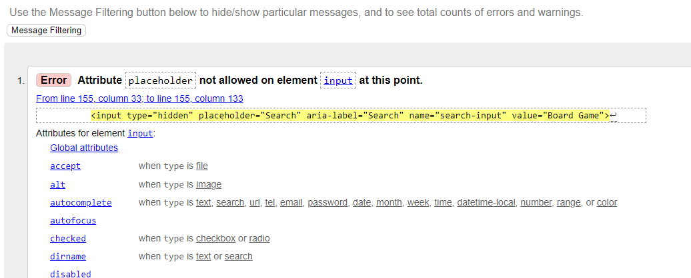

# Testing

[Back to README](README.md)

## Manual Testing

Testing was carried out on a near constant basis, with each new feature

### Account Creation

|#|User action|Expected result| Y/N|
|--|--|--|--|
|1|User clicks on 'Register' link|User is redirected to registration page|Y|
|2|User attempts to signup without filling in required fields|User is promted to fill in relevant required field|Y|
|3|User attempts to signup with existing username|User is prompted to change username|Y|
|4|User attempts to signup without email but all other fields filled correctly|User account is created and user is redirected to home page|Y|
|5|User attempts to signup with all fields filled correctly|User account is created and user is redirected to home page|Y|
|6|User clicks 'sign in' link|User is redirected to login page|Y|

### Account login
|#|User action|Expected result| Y/N|
|--|--|--|--|
|1|User clicks on 'Login' link|User is redirected to login page|Y|
|2|Registered user attempts to login with fields correctly filled in|User is logged in a redirected to home page|Y|
|3|Non-registered user attempts to login with fields filled in|User is told username or password are incorrect|Y|
|4|User clicks 'sign up' link|User is redirected to registration page|Y|

### Pagination
|#|User action|Expected result| Y/N|
|--|--|--|--|
|1|User selects 'next' when pagination is available|User is directed to next page|Y|
|2|User selects 'prev' when pagination is available|User is directed to previous page|Y|

### Home Page
|#|Component|Expected result| Y/N|
|--|--|--|--|
|**Admin User**|
|--|--|--|--|
|1|Navbar|Shows 'Home' Link|Y|
|2|Navbar|Doesn't show 'Login' Link|Y|
|3|Navbar|Doesn't show 'Register' Link|Y|
|4|Navbar|Shows 'Logout' Link|Y|
|5|Navbar|Shows 'Profile' link|Y|
|6|Navbar|Shows 'Wishlist' link|Y|
|7|Navbar|Shows 'Products' link|Y|
|8|Navbar|Shows 'Bag' link|Y|
|9|Navbar|Shows 'Searchbar'|Y|
|10|Main Page|Shows Welcome banner and image|Y|
|11|Main Page|Shows 'Browse Games' button|Y|
|12|Main Page|Clicking on 'Browse Games' button directs you to products page|Y|
|**Authenticated User**|
|1|Navbar|Shows 'Home' Link|Y|
|2|Navbar|Doesn't show 'Login' Link|Y|
|3|Navbar|Doesn't show 'Register' Link|Y|
|4|Navbar|Shows 'Logout' Link|Y|
|5|Navbar|Shows 'Profile' link|Y|
|6|Navbar|Shows 'Wishlist' link|Y|
|7|Navbar|Shows 'Products' link|Y|
|8|Navbar|Shows 'Bag' link|Y|
|9|Navbar|Shows 'Searchbar'|Y|
|10|Main Page|Shows Welcome banner and image|Y|
|11|Main Page|Shows 'Browse Games' button|Y|
|12|Main Page|Clicking on 'Browse Games' button directs you to products page|Y|
|**Non-Authenticated User**| 
|1|Navbar|Shows 'Home' Link|Y|
|2|Navbar|Shows 'Login' Link|Y|
|3|Navbar|Shows 'Register' Link|Y|
|4|Navbar|Doesn't show 'Logout' Link|Y|
|5|Navbar|Doesn't show 'Profile' link|Y|
|6|Navbar|Doesn't show 'Wishlist' link|Y|
|7|Navbar|Shows 'Products' link|Y|
|8|Navbar|Shows 'Bag' link|Y|
|9|Navbar|Shows 'Searchbar'|Y|
|10|Main Page|Shows Welcome banner and image|Y|
|11|Main Page|Shows 'Browse Games' button|Y|
|12|Main Page|Clicking on 'Browse Games' button directs you to products page|Y|

### Products page
|#|Component|Expected result| Y/N|
|--|--|--|--|
|**Admin User**|
|1|Navbar|Shows 'Home' Link|Y|
|2|Navbar|Doesn't show 'Login' Link|Y|
|3|Navbar|Doesn't show 'Register' Link|Y|
|4|Navbar|Shows 'Logout' Link|Y|
|5|Navbar|Shows 'Profile' link|Y|
|6|Navbar|Shows 'Wishlist' link|Y|
|7|Navbar|Shows 'Bag' link|Y|
|8|Navbar|Shows 'Searchbar'|Y|
|10|Main Page|Shows Array of products|Y|
|11|Main Page|Products display an 'Edit' button|Y|
|12|Main Page|Shows pagination links|Y|
|13|Clicking on product image directs to product detail page|Y|
|**Authenticated User**|
|1|Navbar|Shows 'Home' Link|Y|
|2|Navbar|Doesn't show 'Login' Link|Y|
|3|Navbar|Doesn't show 'Register' Link|Y|
|4|Navbar|Shows 'Logout' Link|Y|
|5|Navbar|Shows 'Profile' link|Y|
|6|Navbar|Shows 'Wishlist' link|Y|
|7|Navbar|Shows 'Products' link|Y|
|8|Navbar|Shows 'Bag' link|Y|
|9|Navbar|Shows 'Searchbar'|Y|
|10|Main Page|Shows Array of products|Y|
|11|Main Page|Products don't display an 'Edit' button|Y|
|12|Main Page|Shows pagination links|Y|
|13|Clicking on product image directs to product detail page|Y|
|**Non-Authenticated User**| 
|1|Navbar|Shows 'Home' Link|Y|
|2|Navbar|Shows 'Login' Link|Y|
|3|Navbar|Shows 'Register' Link|Y|
|4|Navbar|Doesn't show 'Logout' Link|Y|
|5|Navbar|Doesn't show 'Profile' link|Y|
|6|Navbar|Doesn't show 'Wishlist' link|Y|
|7|Navbar|Shows 'Products' link|Y|
|8|Navbar|Shows 'Bag' link|Y|
|9|Navbar|Shows 'Searchbar'|Y|
|10|Main Page|Shows Array of products|Y|
|11|Main Page|Products don't display an 'Edit' button|Y|
|12|Main Page|Shows pagination links|Y|
|13|Clicking on product image directs to product detail page|Y|

## Non-Admin Users

In the previous submission, non-admin users were able to access the datastore by adding url endpoints. This has since been rectified in the views by checking whethr the user is a superuser were relevant.

## Errors

While there were numerous bugs and minor errors throughout development, many were common errors such as path-to-file errors or spelling errors when referencing variables or methods. As this is a re-submission, below are the fixes to persistent errors from the previous submission

- ### Payments

Payments now work as intended and the user is sent email confirmation of the order

- Stripe backend

The issue, as far as I can tell, was due to having separate models for the profile and the adress. I had previously simply followed the Boutique Ado tutorial for creating order form data to populate the address and billing info, only referencing my profile model.

- Boutique Ado checkout logic`

- My updated checkou logic

By feeding the required data from both models, the form could save correctly and generate an order. Stripe could then read the neccessary data from the order and continue with the payment process

- ### Addresses

When registering a new user, a blank address was created however the order form is populated and replaces the defalut address, so when a user had not updated their profile before placing an order, and checking the save data option, an error was returned. Now upon registration, a blank address is instantiated and set as the default. 

## Validation

- ### Python 
All python scripts were run through [Code Institute Pep8 linter](pep8ci.herokuapp.com). There were a few instances of lines being too long, however, they could not be indented without causing runtime errors. In this cases '# noqa' was used inline to prevent the error

- ### CSS
CSS files were validated through [W3C CSS validator](https://jigsaw.w3.org/css-validator/).

- base.css

- checkout.css

- ### HTML

Given that django's templateing language interferes with the [W3C Validator](https://validator.w3.org/) readout, the HTML was validated by running the source code of the development site through the validator

I have only included errors below but the html was validated repeatedly until all errors were gone 

- base.html

- bag.html

- checkout error

This is part of loading overlay

- products

- update profile

This seems to be an error raised through rendering crispy forms as my code does not contain the id mentioned.

- wishlist

The wishlist was modelled from the products view so the same error was raised

## Lighthouse

